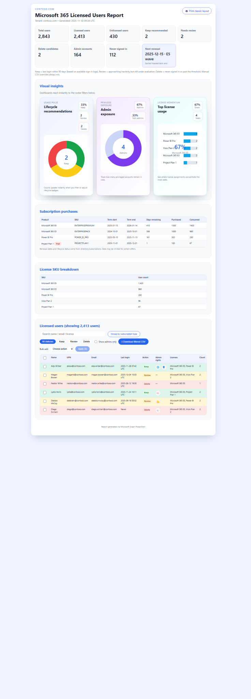

# Microsoft 365 Licensed Users Report


`Get-licensed-users.ps1` exports a polished Microsoft 365 licensed-user report (HTML + optional PDF) directly from Microsoft Graph. It is designed for helpdesk and licensing teams that need an at-a-glance breakdown of licensed accounts, SKU usage, and recommended lifecycle actions. All source files in this repo ship under the MIT License for easy reuse in internal or public GitHub projects.

## Highlights
- **Graph-powered inventory**: pulls all users, license assignments, and subscribed SKUs via Microsoft Graph.
- **Sign-in awareness**: correlates recent sign-ins from the audit log to flag inactive accounts (default 90 days).
- **Lifecycle intelligence**: the HTML dashboard renders KPI cards, donut charts, SKU mix, and sample rows so helpdesk leads can brief stakeholders in one scroll.
- **Interactive filters + quick actions**: color-coded badges and sticky filter chips let you toggle Keep/Review/Delete, bulk-select rows, and recalc the KPIs before exporting or printing.
- **Manual overrides**: optional CSV overrides let you enforce decisions per UPN/email.
- **Beautiful outputs**:
  - Responsive dark-on-light web view with instant print preview.
  - Legacy-print mode that mirrors classic corporate export styling and fits neatly on A4.
  - Optional PDF conversion via `wkhtmltopdf` or Edge/Chrome headless printing.
- **Automatic archiving**: every run stores HTML/PDF copies under `User Reports/<tenant-domain>/<timestamp>` inside the active user’s Documents (OneDrive-aware).
- **Localization packs**: JSON files in `translations/` now cover English, Swedish, and 12 additional languages. Drop in your locale without touching renderer code.
- **Docs-ready assets**: the repo carries mock Contoso HTML/PNG/SVG captures so you can document the experience without exposing tenant data.

## Sample output (Contoso mock data)



The SVG above inlines the high-resolution PNG capture of `assets/sample-report-contoso.html`, so GitHub renders the full multi-section report exactly as the browser does—no masking of production tenants required. If you want to tweak or localize the screenshot:

1. Open `assets/sample-report-contoso.html` in Microsoft Edge/Chrome.
2. Adjust zoom to 100% and use headless Edge/Chrome (`--screenshot`) or your preferred capture tool.
3. Replace `assets/sample-report-contoso.png` with the new capture and rebuild the SVG wrapper so it embeds the updated PNG:

  ```powershell
  pwsh -NoLogo -NoProfile -Command "\n   $png = Get-Content -Path 'assets/sample-report-contoso.png' -AsByteStream\n   $b64 = [Convert]::ToBase64String($png)\n   $svg = @'<svg xmlns='''http://www.w3.org/2000/svg''' width='''1366''' height='''3800''' viewBox='''0 0 1366 3800''' role='''img''' aria-label='''Contoso sample report capture'''>\n     <title>Contoso sample report capture</title>\n     <desc>Pixel-perfect SVG wrapper that embeds the generated HTML report screenshot for README previews.</desc>\n     <image x='''0''' y='''0''' width='''1366''' height='''3800''' href='''data:image/png;base64,{0}'''/>\n   </svg>\n   '@ -f $b64\n   Set-Content -Path 'assets/sample-report-contoso.svg' -Value $svg -Encoding utf8\n   "
  ```

> Tip: keeping the SVG + PNG checked into `assets/` means README previews, GitHub issues, and docs pages will always stay in sync with your latest UI polish.

## Prerequisites
- PowerShell 7+ (recommended) with internet access.
- Microsoft Graph PowerShell SDK (`Microsoft.Graph`, installed automatically if missing).
- Azure AD account with delegated permissions: `User.Read.All`, `Directory.Read.All`, `AuditLog.Read.All`.
- Optional PDF conversion tools:
  - [`wkhtmltopdf`](https://wkhtmltopdf.org/) (preferred) **or**
  - Microsoft Edge / Google Chrome (headless print-to-pdf).

## Parameters (abridged)
| Parameter | Description | Default |
|-----------|-------------|---------|
| `OutputPdfPath` | Custom PDF destination. When omitted, output lands in the timestamped archive folder. | auto-generated |
| `Language` | `English`, `Swedish`, or `Bilingual` labels. | `English` |
| `UseWkHtml` | Forces wkhtmltopdf conversion instead of Edge/Chrome. | `false` |
| `InactiveThresholdDays` | Days without sign-ins before a user is marked “Delete”. | `90` |
| `DecisionOverrideCsvPath` | CSV with per-user keep/delete overrides (columns: `UPN`, `Action`). | none |

## Running the script
```powershell
# Basic run (HTML + PDF archived under Documents\User Reports)
pwsh ./Get-licensed-users.ps1

# Specify a custom PDF path
pwsh ./Get-licensed-users.ps1 -OutputPdfPath C:\Reports\M365-LicensedUsers.pdf

# Supply overrides and stricter inactivity rule
pwsh ./Get-licensed-users.ps1 -InactiveThresholdDays 60 -DecisionOverrideCsvPath .\overrides.csv
```
The first run will prompt for Microsoft Graph consent. Make sure the signed-in account has the required scopes.

## Override CSV format
```csv
UPN,Action
user1@contoso.com,Keep
user2@contoso.com,Delete
```
Supported synonyms include `Keep/Retain/Green/Stay` and `Delete/Remove/Drop/Red`.

## Output location and structure
Each execution creates:
```
Documents\\User Reports\\<tenant-domain>\\<yyyyMMdd-HHmmss>\\
    ├── M365-LicensedUsers.html
    └── M365-LicensedUsers.pdf   (if conversion succeeds or custom path copy)
```
If you pass a custom `OutputPdfPath`, the PDF is also copied into the timestamp folder for auditing.

## Customizing the report
- Modify the CSS inside the script to match your brand colors.
- Translate or adjust localized strings in `Get-LocalizedText`.
- Update the legacy layout if you need different print margins.
- Add or swap languages by editing the JSON files under `translations/`. Each file follows the same key map, so new locales only require copying an existing file, translating the values, and pointing the script to the new language.

## Publishing this workspace to GitHub
Use the following checklist whenever you are ready to share the report generator publicly:

1. Review `LICENSE` and ensure it still reflects how you want others to consume the code (default: MIT).
2. Update `README.md` (this file) with any tenant-specific notes, and keep screenshots in `assets/` so the repo stays self-contained.
3. Commit your latest work:
  ```powershell
  git status
  git add .
  git commit -m "Describe the change"
  ```
4. Push to GitHub:
  ```powershell
  git push origin main
  ```
5. (Optional) create a release or tag to lock in a known-good report template.

Following the steps above keeps the workspace tidy, documents the license in every clone, and makes future contributions straightforward.

## Troubleshooting
- **No PDF produced**: ensure Edge/Chrome or wkhtmltopdf is installed and accessible in `PATH`. The script falls back to HTML and prints instructions if conversion fails.
- **Sign-ins missing**: audit logs only retain ~30 days by default; adjust `InactiveThresholdDays` or provide manual overrides.
- **Permission errors**: re-run `Connect-MgGraph` with an account that has the listed scopes.

## License
Copyright (c) 2025 Bensha1113.

Released under the [MIT License](LICENSE):

```
Permission is hereby granted, free of charge, to any person obtaining a copy
of this software and associated documentation files (the "Software"), to deal
in the Software without restriction, including without limitation the rights
to use, copy, modify, merge, publish, distribute, sublicense, and/or sell
copies of the Software, and to permit persons to whom the Software is
furnished to do so, subject to the following conditions:

The above copyright notice and this permission notice shall be included in all
copies or substantial portions of the Software.

THE SOFTWARE IS PROVIDED "AS IS", WITHOUT WARRANTY OF ANY KIND, EXPRESS OR
IMPLIED, INCLUDING BUT NOT LIMITED TO THE WARRANTIES OF MERCHANTABILITY,
FITNESS FOR A PARTICULAR PURPOSE AND NONINFRINGEMENT. IN NO EVENT SHALL THE
AUTHORS OR COPYRIGHT HOLDERS BE LIABLE FOR ANY CLAIM, DAMAGES OR OTHER
LIABILITY, WHETHER IN AN ACTION OF CONTRACT, TORT OR OTHERWISE, ARISING FROM,
OUT OF OR IN CONNECTION WITH THE SOFTWARE OR THE USE OR OTHER DEALINGS IN THE
SOFTWARE.
```

Feel free to adapt the script for your organization. Consider removing tenant-specific details before publishing publicly.
